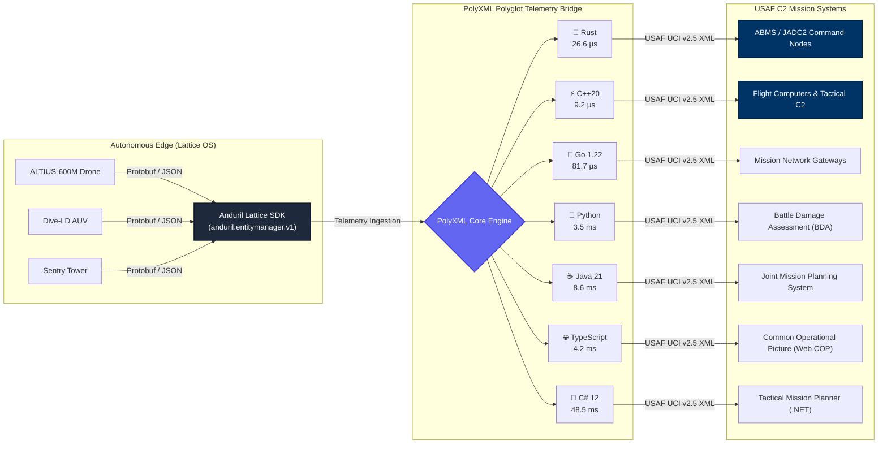

<div align="center">

# 🛸 PolyXML Polyglot Examples: Anduril Lattice SDK ↔ USAF UCI C2 Bridge

[](https://github.com/nth-bailey/polyxml-examples/actions/workflows/ci.yml)
[](https://github.com/nth-bailey/PolyXML)
[](https://github.com/open-arsenal/uci)
[](https://buf.build/anduril/lattice-sdk)
[](#polyglot-implementations)
[](LICENSE)

**Next-generation defense autonomy meets battle-tested mission command & control.**

*A production-grade, polyglot integration showcase bridging autonomous edge telemetry from the **Anduril Lattice SDK** (Protobuf/JSON) with the **USAF Universal Command and Control Interface (UCI v2.5)** XML standard across **all 7 programming languages** supported by [PolyXML](https://github.com/nth-bailey/PolyXML).*

</div>

---

## 📖 Table of Contents

- [Executive Summary](#-executive-summary)
- [System Architecture](#-system-architecture)
- [Semantic Field Mapping](#-semantic-field-mapping)
- [Polyglot Benchmark & Implementations](#-polyglot-benchmark--implementations)
  - [1. Rust (Zero-Copy Streaming)](#1-rust-zero-copy-streaming)
  - [2. Python (Dataclasses & Native Engine)](#2-python-dataclasses--native-engine)
  - [3. Go (Dual Struct Tags)](#3-go-dual-struct-tags)
  - [4. Modern C++20 (Header-Only Value Types)](#4-modern-c20-header-only-value-types)
  - [5. Java 21+ (Records & Sealed Interfaces)](#5-java-21-records--sealed-interfaces)
  - [6. TypeScript 5+ (Typed Interfaces & Zod)](#6-typescript-5-typed-interfaces--zod)
  - [7. C# 12 / .NET 8 (Primary Constructor Records)](#7-c-12--net-8-primary-constructor-records)
- [CLI Streaming Transcoder](#-cli-streaming-transcoder)
- [Schema Validation (Full USAF UCI v2.5)](#-schema-validation-full-usaf-uci-v25)
- [Repository Structure](#-repository-structure)
- [Getting Started](#-getting-started)
- [License](#-license)

---

## 🎯 Executive Summary

Autonomous defense systems (unmanned aerial systems, loitering munitions, edge sensor nodes) deployed on networks like **Anduril Lattice** communicate using compact, high-frequency Protobuf and JSON telemetry. Conversely, United States Air Force and DoD joint mission systems, command centers, and legacy avionics communicate over standardized XML using the **Air Force Research Laboratory (AFRL) UCI (Universal Command and Control Interface)** standard.

Traditionally, bridging these two environments requires:
- ❌ Massive, slow legacy C++ XML runtimes (like Apache Xerces-C++) that bloat embedded flight software.
- ❌ Fragmented XML data-binding tools (`jaxb`, `xsd.exe`, `xsdata`) that produce incompatible models and slow reflection-based parsing.
- ❌ High latency and memory allocations unacceptable for real-time edge gateways.

**PolyXML eliminates these pain points:**
- ✅ **Single Source of Truth**: Generates idiomatic, typed models from the official USAF UCI v2.5 XML schemas across **all 7 target languages** using a unified manifest (`polyxml.toml`).
- ✅ **Dual Codecs**: Every model natively supports both XML and JSON serialization with bidirectional zero-copy transcoding.
- ✅ **Extreme Performance**: Microsecond serialization latencies (as low as **9.2 μs** in C++ and **26 μs** in zero-copy Rust).

---

## 🏛 System Architecture



---

## 🗺 Semantic Field Mapping

The bridge translates telemetry from `anduril.entitymanager.v1.Entity` into compliant USAF UCI `uci:EntityMT` messages:

| Anduril Lattice Telemetry Field | USAF UCI v2.5 XML Element | UCI XSD Type | Description |
| :--- | :--- | :--- | :--- |
| `id` | `EntityID/UUID` | `xs:string` | Unique global asset / track identifier |
| `callsign` | `EntityID/Callsign` | `xs:string` | Human-readable tactical callsign |
| `timestamp` | `CreationTimestamp` | `xs:dateTime` | ISO 8601 UTC creation timestamp |
| `timestamp` | `MessageHeader/Timestamp` | `xs:dateTime` | Header transmission timestamp |
| `status` (`CONFIRMED`) | `EntityStatus` | `EntityStatusEnum` | Track status (`POTENTIAL`, `CONFIRMED`, `LOST`, `DROPPED`) |
| `location.latitude` | `Kinematics/Latitude` | `xs:double` | WGS-84 Latitude degrees (-90.0 to 90.0) |
| `location.longitude` | `Kinematics/Longitude` | `xs:double` | WGS-84 Longitude degrees (-180.0 to 180.0) |
| `location.altitude_meters` | `Kinematics/Altitude` | `xs:double` | Height above WGS-84 ellipsoid (meters) |
| `kinematics.heading_degrees` | `Kinematics/Heading` | `xs:double` | True heading (0.0 to 360.0 degrees) |
| `kinematics.ground_speed_mps` | `Kinematics/GroundSpeed` | `xs:double` | Horizontal velocity over ground (m/s) |
| `kinematics.vertical_speed_mps` | `Kinematics/VerticalSpeed` | `xs:double` | Rate of climb / descent (m/s) |
| `source_system` | `SourceSystem` | `xs:string` | Originating subsystem / mesh node ID |
| `classification` (`SECRET`) | `SecurityInformation/Classification` | `ClassificationEnum` | Security marking (`UNCLASSIFIED`, `CONFIDENTIAL`, `SECRET`, `TOP_SECRET`) |

---

## ⚡ Polyglot Benchmark & Implementations

Every implementation ingests the identical sample autonomous asset telemetry file (`data/lattice_entity.json`), translates it into strongly-typed UCI structures, and serializes both USAF UCI XML and canonical JSON:

| Language | Paradigm | Codec Architecture | Serialization Latency | Code Location |
| :--- | :--- | :--- | :--- | :--- |
| **C++20** | Modern C++ | Header-Only Value Types, Zero External Deps | **9.2 μs** (JSON) / **56.4 μs** (XML) | [`examples/cpp/`](examples/cpp/) |
| **Rust** | Zero-Copy | Borrowed Slices (`Cow<'a, str>`), Streaming Codecs | **26.6 μs** (XML) / **27.0 μs** (JSON) | [`examples/rust/`](examples/rust/) |
| **Go** | Microservice | Dual Tagged Structs (`xml:"..." json:"..."`) | **81.7 μs** (XML) / **101.0 μs** (JSON) | [`examples/go/`](examples/go/) |
| **TypeScript** | Web / Node | Typed Interfaces + Zod Runtime Schema Validation | **384 μs** (JSON) / **4.2 ms** (XML) | [`examples/typescript/`](examples/typescript/) |
| **Python** | Data Science | PolyXML Engine + `@dataclass` | **3.5 ms** (XML / JSON Roundtrip) | [`examples/python/`](examples/python/) |
| **Java 21+** | Enterprise | Records + Sealed Interfaces (Java 21) | **8.6 ms** (XML) / **14.5 ms** (JSON) | [`examples/java/`](examples/java/) |
| **C# 12** | Mission Apps | Primary Constructor Records (.NET 8) | **48.5 ms** (XML) / **26.5 ms** (JSON) | [`examples/csharp/`](examples/csharp/) |

---

### 1. Rust (Zero-Copy Streaming)

```rust
// Borrow string slices directly from incoming Lattice payload with zero heap allocations
let uci_msg = EntityMt {
    object_state: Some(ObjectStateEnum::Active),
    message_data: EntityMdt {
        entity_id: EntityIdType {
            uuid: Cow::Borrowed(&lattice.id),
            callsign: lattice.callsign.as_deref().map(Cow::Borrowed),
        },
        creation_timestamp: Cow::Borrowed(&lattice.timestamp),
        entity_status: EntityStatusEnum::Confirmed,
        kinematics: KinematicsType {
            latitude: lattice.location.latitude,
            longitude: lattice.location.longitude,
            altitude: lattice.location.altitude_meters,
            heading: lattice.kinematics.heading_degrees,
            ground_speed: lattice.kinematics.ground_speed_mps,
            vertical_speed: lattice.kinematics.vertical_speed_mps,
        },
        source_system: lattice.source_system.as_deref().map(Cow::Borrowed),
    },
};

// Stream directly to XML string in 26 μs
let xml_output = uci_msg.to_xml_string()?;
```

**Run it:**
```bash
cargo run --manifest-path examples/rust/Cargo.toml
```

---

### 2. Python (Dataclasses & Native Engine)

```python
import polyxml

# Zero-copy bidirectional transcoding with namespace preservation
json_output = polyxml.xml_to_json(xml_output, indent=2)
roundtrip_xml = polyxml.json_to_xml(json_output, root="EntityMT", indent=2)
```

**Run it:**
```bash
python3 examples/python/bridge.py
```

---

### 3. Go (Dual Struct Tags)

```go
type EntityMdt struct {
    XMLName           xml.Name         `json:"-"`
    EntityID          EntityIdType     `xml:"EntityID" json:"EntityID"`
    CreationTimestamp time.Time        `xml:"CreationTimestamp" json:"CreationTimestamp"`
    EntityStatus      EntityStatusEnum `xml:"EntityStatus" json:"EntityStatus"`
    Kinematics        KinematicsType   `xml:"Kinematics" json:"Kinematics"`
    SourceSystem      *string          `xml:"SourceSystem,omitempty" json:"SourceSystem,omitempty"`
}
```

**Run it:**
```bash
go run ./examples/go
```

---

### 4. Modern C++20 (Header-Only Value Types)

```cpp
#include "uci_entity_core.hpp"
using namespace polyxml::generated;

EntityMt entity;
entity.object_state = ObjectStateEnum::Active;
entity.security_information.classification = ClassificationEnum::Secret;
entity.message_data.kinematics.latitude = 34.9125;
entity.message_data.kinematics.longitude = -117.8833;
static_assert(XmlModel<EntityMt>); // Enforced via C++20 concept
```

**Run it:**
```bash
cmake -B examples/cpp/build examples/cpp && cmake --build examples/cpp/build && ./examples/cpp/build/lattice_uci_bridge
```

---

### 5. Java 21+ (Records & Sealed Interfaces)

```java
public record KinematicsType(
    double latitude,
    double longitude,
    double altitude,
    Optional<Double> heading,
    Optional<Double> groundSpeed,
    Optional<Double> verticalSpeed
) {}
```

**Run it:**
```bash
mvn -f examples/java/pom.xml compile exec:java
```

---

### 6. TypeScript 5+ (Typed Interfaces & Zod)

```typescript
import { EntityMtSchema, type EntityMt } from "./generated/typescript/uci_entity_core.ts";

const uciEntity: EntityMt = translateLatticeToUCI(lattice);
// Runtime contract validation before transmission over tactical WebSocket / COP
EntityMtSchema.parse(uciEntity);
```

**Run it:**
```bash
node --experimental-strip-types examples/typescript/index.ts
```

---

### 7. C# 12 / .NET 8 (Primary Constructor Records)

```csharp
[XmlRoot("EntityMT", Namespace = "https://www.vdl.afrl.af.mil/programs/oam")]
public record EntityMt(
    [property: XmlElement("ObjectState"), JsonPropertyName("ObjectState")] ObjectStateEnum? ObjectState,
    [property: XmlElement("MessageData"), JsonPropertyName("MessageData")] EntityMdt MessageData
) : MessageType, IValidatableObject;
```

**Run it:**
```bash
dotnet run --project examples/csharp/LatticeUciAdapter.csproj
```

---

## 🔄 CLI Streaming Transcoder

PolyXML features a built-in, standalone CLI streaming transcoder that transforms XML into JSON and JSON into XML over Unix pipes with zero data loss:

```bash
# Transcode USAF UCI XML into canonical JSON
cat data/uci_entity.xml | polyxml transcode --to json --pretty

# Transcode JSON telemetry into USAF UCI XML
cat data/lattice_entity.json | polyxml transcode --to xml --root EntityMT --pretty
```

Run the interactive demonstration:
```bash
./scripts/run_transcode_demo.sh
```

---

## 🛡 Schema Validation (Full USAF UCI v2.5)

PolyXML includes an industrial-grade XSD validator capable of parsing and validating the complete, official **8.3 MB** USAF UCI v2.5 schema containing **5,558 types** and **722 root elements**:

```bash
polyxml validate schemas/uci/UCI_MessageDefinitions_v2_5_0.xsd
```

Output:
```
✓ Valid schema: schemas/uci/UCI_MessageDefinitions_v2_5_0.xsd
  targetNamespace: https://www.vdl.afrl.af.mil/programs/oam
  Components: 5557 types, 722 root elements

All schemas valid (Total: 5557 types, 722 elements).
```

---

## 📂 Repository Structure

```text
polyxml-examples/
├── .github/workflows/ci.yml       # GitHub Actions multi-language CI pipeline
├── polyxml.toml                   # PolyXML workspace compilation manifest
├── go.work                        # Go workspace manifest
├── package.json                   # Node.js workspace dependencies (Zod)
├── schemas/
│   ├── lattice/entity.proto       # Canonical Anduril Lattice telemetry Protobuf schema
│   └── uci/
│       ├── uci_entity_core.xsd    # Streamlined AFRL UCI Entity core schema
│       ├── UCI_MessageDefinitions_v2_5_0.xsd # Full 8.0 MB Open-Arsenal UCI v2.5 specification
│       ├── UCI_SecurityMarkings_v2_5_0.xsd   # Full DoD security markings XSD
│       └── UCI_Versioning_v2_5_0.xsd         # UCI versioning attributes XSD
├── data/
│   ├── lattice_entity.json        # Autonomous ALTIUS-600M loitering munition track payload
│   └── uci_entity.xml             # Validated USAF UCI v2.5 Entity XML message
├── generated/                     # PolyXML compiler outputs (rebuilt via 'polyxml build')
│   ├── rust/uci_entity_core.rs
│   ├── python/uci_entity_core.py
│   ├── go/uci_entity_core.go
│   ├── cpp/uci_entity_core.hpp
│   ├── java/*.java
│   ├── typescript/uci_entity_core.ts
│   └── csharp/UciEntityCore.cs
├── examples/                      # Runnable bridge implementations
│   ├── rust/                      # Rust zero-copy streaming bridge
│   ├── python/                    # Python dataclass / PolyXML bridge
│   ├── go/                        # Go microservice gateway
│   ├── cpp/                       # Modern C++20 flight computer adapter
│   ├── java/                      # Java 21+ records adapter
│   ├── typescript/                # Web / COP tactical map adapter
│   └── csharp/                    # .NET 8 tactical planner app
└── scripts/
    ├── run_all.sh                 # Master test runner executing all 7 languages
    └── run_transcode_demo.sh      # CLI streaming pipes demonstration
```

---

## 🚀 Getting Started

### Prerequisites

To build and run all 7 language examples, ensure the relevant runtimes are installed:
- **Rust** 1.80+ (`cargo`)
- **Python** 3.10+ (`python3`)
- **Go** 1.22+ (`go`)
- **C++20** (`cmake` 3.20+ and `g++` or `clang++` with C++20 support)
- **Java** 21+ (`javac` and `mvn`)
- **Node.js** 22+ (`node`)
- **.NET** 8.0+ SDK (`dotnet`)

### One-Command Full Suite Execution

Run the unified test runner to compile schemas and verify all 7 languages sequentially:

```bash
git clone https://github.com/nth-bailey/polyxml-examples.git
cd polyxml-examples
./scripts/run_all.sh
```

---

## 📜 License

Distributed under the MIT License. See [`LICENSE`](LICENSE) for more information.
All schemas sourced from public US Government releases and open specifications ([Open-Arsenal UCI](https://github.com/open-arsenal/uci) and [Buf Lattice SDK](https://buf.build/anduril/lattice-sdk)).
